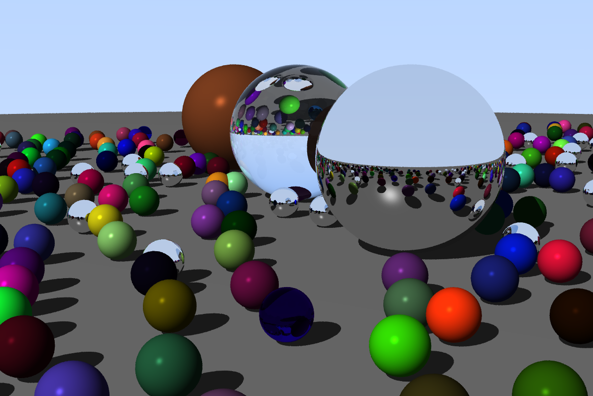

# Ray-Tracer
> Brute force C++ Whitted ray tracer build for learning computer graphics techniques.

 

# Features
* Shapes: sphere
* Lights: point light, directional light
* Phong shading
* Reflection
* Refraction
* Shadows
* Stratified sampler

# Setup
Compile and run.
Image is outputted in PPM file format.

# See Also
Ray Tracing in One Weekend by Peter Shirley. Most of the starting structure of this ray tracer is based on the code from this book.
